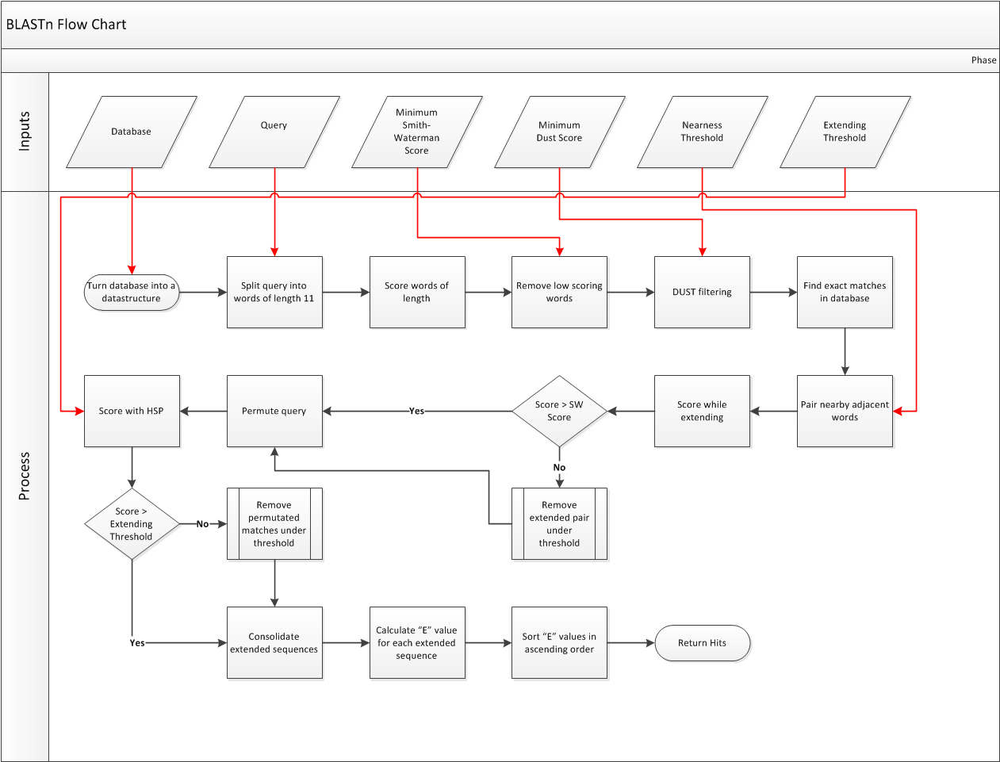

# Blastn
An implementation of the basic local alignment search tool
(BLAST) algorithm on an FPGA to hardware accelerate the process.

## Members
Electrical and Computer Engineering Senior Project
at California State Polytechnic University, Pomona
- Alden Param
- Alex Chan
- Hmayak Apetyan
- Jacob London
- Simon Tutak
- Sivaramakrishnan Prabakar

## Advisors
- Mohamed El-Hadedy (Mohamed Aly)
- Mostafa M. Hashim Ellabaan

## Requirements
The first implementation will be in Python 3 and uses the
standard built in Python libraries.

# To Do
* Python
  * Pair adjacent matches
  * Sort extended matches
* C++
  * Implement Python to C++
  * Implement OpenCL